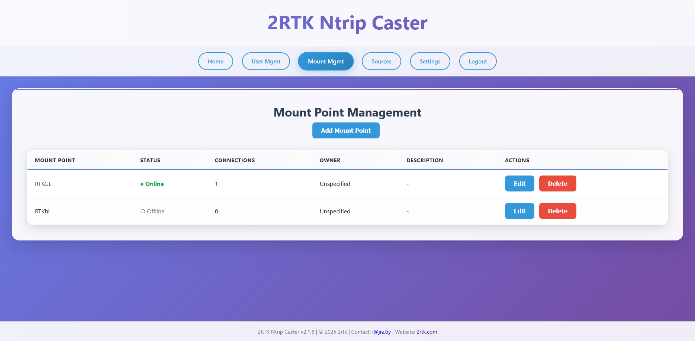
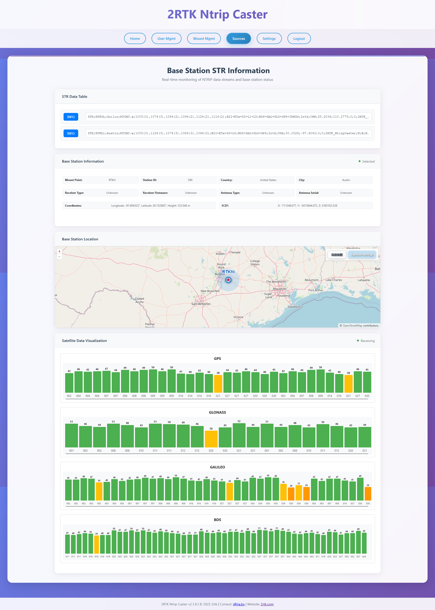

# 2RTK NTRIP Caster v2.2.0

**Language / 语言选择:**
- [English](README.md)
- [中文版](#) (当前)

---

这是一个使用python编写的简易的NTRIP caster，支持NTRIP v1.0和v2.0协议，使用web管理页面管理。
可以使用web在浏览器添加用户和挂载点等信息，也可以在浏览器查看NTRIPcaster的连接信息。
它支持高并发连接，能够处理2000+的并发连接数。（因为我的测试环境有限，所以我只测试了2个RTCM数据源。2000用户并发的数据下载，但是它的性能表现非常好）

它以前是一个单独的文件2rtk.py，我最近重构了它。现在看起来胖了很多.但是我感觉它还是比较轻量级的。lol

- 使用web管理。所以你可以把它部署在任意的云主机上.
- 使用SQLite数据库存储用户信息和挂载点信息.
- 借用了pyrtcm库，会对上传的数据进行解析然后修正STR表（这部分代码重写了几次.但是我总感觉不满意，包括现在的版本.期待后续更新）.
    （你只需要在web页面添加一个挂载点，然后上传RTCM数据，2rtk-NtripCaster会自动生成STR信息.并且会解析RTCM数据从中提取数据类型等位置信息对STR进行修正）
- 这个NTRIP caster和我心中的caster还很远。我会在空闲的时间慢慢去完善它。
- 它支持大多数装有python环境的系统，包括debian、ubuntu、centos、armbian等。
- 支持docker部署。

## 安装教程

### Docker 部署（推荐）
推荐一键部署，无需手动配置。
```bash
# 拉取并直接运行，镜像会自动创建所需目录和配置文件
docker run -d \
  --name ntrip-caster \
  -p 2101:2101 \
  -p 5757:5757 \
  2rtk/ntripcaster:latest
```
- **中文教程**: [Docker 安装和使用教程](DOCKER-TUTORIAL.md)
- **English Tutorial**: [Docker Installation and Usage Guide](DOCKER-TUTORIAL-EN.md)

### Debian系统原生安装
- **中文教程**: [Linux 系统原生安装教程](INSTALL-TUTORIAL.md)
- **English Tutorial**: [Linux Native Installation Guide](INSTALL-TUTORIAL-EN.md)

**访问地址**:
-  Web管理界面: `http://yourserverip:5757`
-  NTRIP服务: `ntrip://yourserverip:2101`
-  默认账号: `admin` / `admin123` (记得修改默认密码)

## 硬件推荐

### 最低配置要求
- **CPU**: 2核心 (推荐 x86_64 架构)
- **内存**: 2GB RAM
- **存储**: 10GB 可用磁盘空间
- **网络**: 稳定的网络连接
- **操作系统**: Ubuntu 18.04+ / Debian 10+ / CentOS 7+

## 前端Web界面功能
### 首页
你可以在首页看到当前caster的运行状态，包括连接数、用户数、挂载点数等。以及下方的日志信息会实时推送用户或者挂载点的连接情况。DEBUG模式会推送更多的调试信息。


### 用户管理页面
你可以在用户管理页面添加用户，删除用户，修改用户密码等。也可以看到在线的用户。（后期会添加对用户的管理，API已预留）


### 挂载点管理页面
你可以在挂载点管理页面添加挂载点，删除挂载点，修改挂载点信息等。也可以看到在线信息。（后期添加挂载点管理，API已预留）



### 基准站信息页面
你可以在基准站信息页面查看RTCM情况，点击STR条目前INFO按钮，后台会对其进行解析，然后显示在下方的信息中。（这通常需要一点时间解析才会更新显示）



### 不同负载下的配置建议

| 并发连接数 | CPU | 内存 | 存储 | 网络带宽 |
|-----------|-----|------|------|----------|
| **< 100** | 1核心 | 1GB | 5GB | 10Mbps |
| **100-500** | 2核心 | 2GB | 10GB | 50Mbps |
| **500-1000** | 4核心 | 4GB | 20GB | 100Mbps |
| **1000-2000** | 8核心 | 8GB | 50GB | 200Mbps |
| **2000+** | 16核心+ | 16GB+ | 100GB+ | 500Mbps+ |

### 云服务器推荐
云服务器部署请在安全设置中开启5757和2101端口
#### AWS EC2
- **入门型**: t3.small (2核2GB)
- **标准型**: c5.large (2核4GB)
- **高性能**: c5.2xlarge (8核16GB)

## 性能基准测试

- **500连接测试**: CPU 18.1%, 内存 29.5%, 网络 7.47 Mbps
- **1000连接测试**: CPU 19.1%, 内存 33.9%, 网络 10.79 Mbps  
- **2000连接极限测试**: CPU 17.3%, 内存 30.3%, 网络 7.69 Mbps

> 详细测试报告请查看 [tests/](tests/) 目录

## 配置指南

### 主要配置选项

```ini
[ntrip]
port = 2101                    # NTRIP服务端口
max_connections = 5000         # 最大连接数

[web] 
port = 5757                    # Web管理端口
refresh_interval = 10          # 数据刷新间隔

[performance]
thread_pool_size = 5000        # 并发连接线程池大小
max_workers = 5000             # 最大工作线程
ring_buffer_size = 60          # 环形缓冲区大小

[security]
secret_key = your-secret-key   # 生产环境请修改默认的key

[admin]
username = admin               # 管理员用户名
password = admin123            # 管理员密码（生产环境请修改）
```

### 常见问题诊断

#### 端口占用问题
```bash
# 检查端口占用
sudo netstat -tlnp | grep :2101    # NTRIP端口
sudo netstat -tlnp | grep :5757    # Web管理端口
sudo lsof -i :2101                 # 查看端口使用情况

# 释放端口
sudo kill -9 <PID>                 # 强制结束进程
sudo fuser -k 2101/tcp             # 强制释放端口
```

#### 网络连接问题
```bash
# 防火墙检查
sudo ufw status                    # Ubuntu防火墙
sudo firewall-cmd --list-all       # CentOS防火墙

# 开放端口
sudo ufw allow 2101/tcp            # NTRIP端口
sudo ufw allow 5757/tcp            # Web管理端口

# 网络连通性测试
telnet localhost 2101              # 测试NTRIP端口
curl http://localhost:5757/        # 测试Web端口
```

#### 服务启动失败
```bash
# 检查服务状态
sudo systemctl status 2rtk

# 查看详细日志
sudo journalctl -u 2rtk -f

# 检查配置文件
python3 -c "import configparser; c=configparser.ConfigParser(); c.read('config.ini'); print('配置文件语法正确')"

# 检查端口权限
sudo netstat -tlnp | grep :2101
```

#### 数据库问题
```bash
# 检查数据库文件权限
ls -la data/2rtk.db

# 重建数据库（谨慎操作）
rm data/2rtk.db
python3 main.py  # 会自动创建新数据库
```

#### 内存使用过高
```bash
# 监控内存使用
top -p $(pgrep -f "python.*main.py")

# 调整配置降低内存使用
# 在config.ini中减少以下参数：
# max_connections = 1000
# thread_pool_size = 1000
# ring_buffer_size = 30
```

### 性能优化

#### 高并发配置
```ini
# config.ini 优化配置
[ntrip]
max_connections = 10000            # 最大连接数
port = 2101

[performance]
thread_pool_size = 10000           # 线程池大小
max_workers = 10000                # 最大工作线程
ring_buffer_size = 60              # 环形缓冲区

[network]
buffer_size = 16384                # 网络缓冲区
timeout = 30                       # 连接超时
```

### 监控和日志

#### 日志级别配置
```ini
# config.ini 日志配置
[logging]
level = INFO                       # DEBUG, INFO, WARNING, ERROR
format = json                      # json, text
rotate_size = 100MB               # 日志轮转大小
rotate_count = 10                 # 保留日志文件数
```

## 贡献

- 欢迎提交 Pull Request
- 联系方式: i@jia.by

## 致谢与开源库

本项目使用了以下优秀的开源库和工具，在此表示诚挚的感谢：

### 核心依赖

| 库 | 版本 | 用途 | 许可证 |
|----|------|------|--------|
| **Flask** | 2.3.3 | Web框架，提供HTTP服务和API | BSD-3-Clause |
| **Flask-SocketIO** | 5.3.6 | WebSocket实时通信支持 | MIT |
| **python-socketio** | 5.8.0 | Socket.IO协议实现 | MIT |
| **psutil** | 5.9.5 | 系统性能监控和资源统计 | BSD-3-Clause |
| **pyproj** | 3.6.1 | 地理坐标系统转换和投影计算 | MIT |

### RTCM解析库

**pyrtcm** - 核心RTCM消息解析库
- **来源**: 基于标准 [pyrtcm](https://github.com/semuconsulting/pyrtcm) 库源码集成
- **版本**: 集成版本（防止上游仓库删除风险）
- **作者**: semuconsulting
- **许可证**: BSD-3-Clause
- **用途**: 提供完整的RTCM 3.x消息解析、编码和解码功能
- **说明**: 为确保项目稳定性，建议直接将pyrtcm库源码集成到项目中，避免外部依赖风险

## 开源许可证

本项目采用 [Apache License 2.0](LICENSE) 许可证。

### 第三方库许可证

- **pyrtcm**: BSD-3-Clause 许可证
- **Flask系列**: MIT/BSD 许可证  
- **psutil**: BSD-3-Clause 许可证
- **pyproj**: MIT 许可证

所有集成的第三方库均保持其原有的开源许可证。使用时请遵守相应的许可证条款。

---

**如果这个项目对您有帮助，请给我一个 Star！**